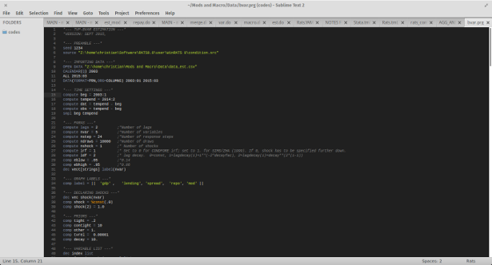

#Rats (Estima) Syntax Highlighting
Christian Danne (dannec@tcd.ie)  

Version: Jul 26 2015  

###Description
Provides syntax highlighting for [Rats](https://www.estima.com) (Estima) in [Atom](https://atom.io/),  and [Sublime Text](https://www.sublimetext.com/) (see screenshot below). 

###Important notes
Note that only .rpf files will get automatically recognised, since .prg and .src files are primarily associated with other languages. For .prg and .src files, please select the syntax manually. 

If you have suggestions or find any errors, such as missing key words, please contact me at dannec@tcd.ie. 

###Installation instructions
To install the package in Sublime Text, 
- unzip the Rats.tar.gz file contained in this directory and copy it into your packages directory. 
- If you do not know where your package directory is located, hit Crtl+ to open the console in Sublime Text to get the path. 
 
- Close and re-open Atom and Rats should show up under View -> Syntax

 
To install the package Atom, 
- unzip angugage-Rats.tar.gz and copy it into your packages directory. 
- If you do not know where your package directory is located, hit Crtl+Comma to open Settings. You will find the package directory path under Install. 
- Close and re-open Sublime Text. 
- Hit Crtl+Shift+L and check if Rats shows up under Grammars. 

###Changelog
2015-11-29 Initial release.
  
 

 
 

 

 
